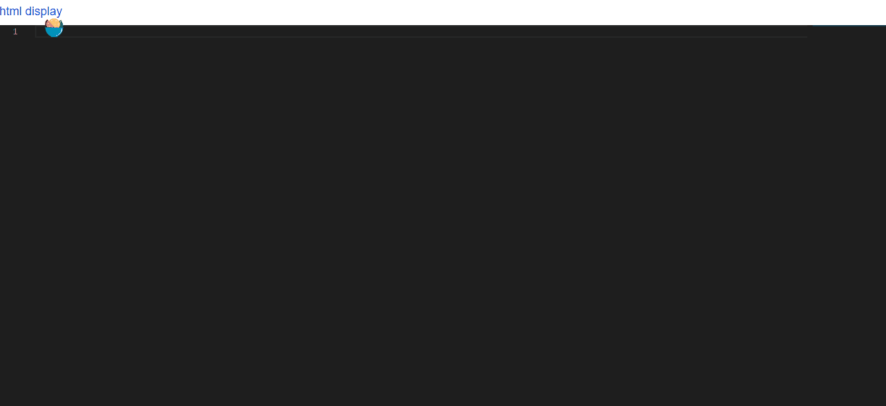

# online editor
when you try to code some simple examples 
you need  
~~make new file `*.html`~~  
~~code~~  
~~open browser to check~~  
~~delete file `*.html`~~  
open browser [editor](http://editor.souptop.com:8080/)
## Usage
```cmd
git clone https://github.com/wk989898/JS-editor-online.git
npm install
npm start [port] //default 8080 8081
```
## Suggest
 you could deployment your server ,have a look [personal folder](./personal)  
 
---

